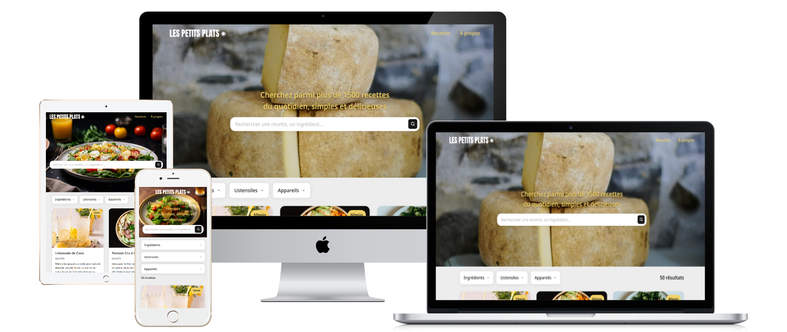

<div align="center" style="margin: 24px 0;">
  <h1>
    
    Les Petits Plats
  </h1>
  <p>
    Application web moderne permettant de rechercher parmi plus de 1500 recettes culinaires.<br>
    Interface intuitive avec recherche en temps réel, filtres avancés par ingrédients, appareils et ustensiles, et affichage optimisé des résultats.
  </p>
  <p>
    
  </p>

  <p>
    🚀 <a href="https://steinshy.github.io/OC-LesPetitPlats/" target="_blank"><strong>Accéder à l'application en ligne</strong></a>
  </p>
  <p>
    
    
    
    
    
    
    
    
    
  </p>
  <p>
    
    
    
    
    
  </p>
</div>

## 🎯 À propos

> Les Petits Plats est une Progressive Web App (PWA) développée avec des technologies modernes. L'application offre une expérience utilisateur fluide avec recherche instantanée et filtrage dynamique. Optimisée pour les performances, elle inclut un système de cache, un service worker pour le mode hors ligne, et une interface responsive.

## ✨ Fonctionnalités

- 🔍 **Recherche en temps réel** : Recherche dans les noms, descriptions, ingrédients et ustensiles
- 🎛️ **Filtrage avancé** : Filtres par ingrédients, appareils et ustensiles avec menus déroulants interactifs
- 📊 **Compteur de résultats** : Affichage dynamique du nombre de recettes trouvées
- 📱 **Design responsive** : Interface adaptée à tous les écrans
- 🚀 **PWA** : Installation possible sur appareils mobiles et fonctionnement hors ligne
- ⚡ **Performance optimisée** : Système de cache, lazy loading des images, optimisations des assets
- 🎨 **Interface moderne** : Design épuré avec Tailwind CSS

## 📦 Prérequis

- **Node.js** (version 18 ou supérieure)
- **npm** (version 9 ou supérieure)

## 🚀 Installation

```bash
git clone https://github.com/steinshy/OC-LesPetitPlats.git
cd LesPetitPlats
npm install
npm run dev
```

L'application sera accessible à l'adresse `http://localhost:5173`.

## 💻 Utilisation

**Commandes principales** :

- `npm run dev` - Serveur de développement
- `npm run build` - Build de production
- `npm run preview` - Prévisualisation du build

### Recherche et filtrage

1. **Recherche par texte** : Saisissez un terme dans la barre de recherche (nom de recette, ingrédient, etc.)
2. **Filtres par catégorie** : Utilisez les menus déroulants pour filtrer par :
   - Ingrédients
   - Appareils
   - Ustensiles
3. **Filtres actifs** : Les filtres sélectionnés apparaissent sous les menus avec possibilité de les retirer
4. **Combinaison** : Recherche textuelle et filtres peuvent être combinés pour affiner les résultats

## 📜 Scripts disponibles

| Commande                  | Description                                              |
| ------------------------- | -------------------------------------------------------- |
| `npm run dev`             | Serveur de développement                                 |
| `npm run build`           | Build de production                                      |
| `npm run preview`         | Prévisualisation du build                                |
| `npm test`                | Tests unitaires                                          |
| `npm run test:ui`         | Interface UI pour les tests                              |
| `npm run test:coverage`   | Tests avec couverture de code                            |
| `npm run lint`            | Vérification du code (ESLint, Stylelint, HTML, Markdown) |
| `npm run lint:fix`        | Correction automatique ESLint                            |
| `npm run format`          | Formatage du code avec Prettier                          |
| `npm run analyze`         | Analyse du bundle                                        |
| `npm run optimize:images` | Optimisation des images                                  |
| `npm run clean`           | Nettoyage des dossiers de build                          |
| `npm run lighthouse`      | Rapport Lighthouse                                       |

## 🛠️ Technologies

- **Vite 7** - Build tool et serveur de développement
- **Tailwind CSS 4** - Framework CSS utility-first
- **PWA** - Progressive Web App avec Service Worker
- **Neverthrow** - Gestion d'erreurs fonctionnelle
- **Query String** - Gestion des paramètres d'URL

### Qualité du code

Le projet utilise plusieurs outils pour maintenir la qualité du code :

- **ESLint** : Analyse statique du code JavaScript
- **Stylelint** : Validation des styles CSS
- **HTML Validate** : Validation HTML
- **Prettier** : Formatage automatique du code

```bash
npm run lint
npm run lint:fix
npm run format
```

## 📁 Structure du projet

```text
LesPetitPlats/
├── public/                       # Fichiers statiques
│   ├── api/                     # Données des recettes
│   │   ├── data.json           # Base de données des recettes
│   │   └── data.js             # Version JavaScript
│   ├── favicons/                # Icônes et logos
│   ├── recipes/                 # Images des recettes
│   └── sw.js                    # Service Worker
│
├── src/                         # Code source
│   ├── App.js                   # Point d'entrée de l'application
│   │
│   ├── components/              # Composants UI
│   │   ├── cards/              # Cartes de recettes
│   │   │   ├── manager.js      # Gestion des cartes
│   │   │   └── render.js       # Rendu des cartes
│   │   │
│   │   ├── dropdown/           # Menus déroulants
│   │   │   ├── manager.js      # Gestion des menus
│   │   │   ├── render.js       # Rendu des menus
│   │   │   ├── data.js         # Gestion des données
│   │   │   └── elements.js     # Éléments DOM
│   │   │
│   │   ├── filters/            # Filtres de recherche
│   │   │   ├── manager.js      # Gestion des filtres
│   │   │   ├── render.js       # Rendu des filtres
│   │   │   ├── recipeFilters.js # Logique de filtrage
│   │   │   └── elements.js     # Éléments DOM
│   │   │
│   │   ├── search/             # Recherche
│   │   │   ├── manager.js      # Gestion de la recherche
│   │   │   ├── render.js       # Rendu de la recherche
│   │   │   └── elements.js     # Éléments DOM
│   │   │
│   │   ├── bodyScroll.js       # Gestion du scroll
│   │   ├── renderHeaderImg.js  # Image d'en-tête
│   │   ├── skeletonsRenderer.js # Squelettes de chargement
│   │   ├── resultsCounter.js   # Compteur de résultats
│   │   ├── scrollToTop.js      # Bouton scroll to top
│   │   └── skeletonsManager.js # Gestion des squelettes
│   │
│   └── utils/                   # Utilitaires
│       ├── cache.js            # Système de cache
│       ├── deliveryImages.js   # Gestion des images
│       ├── errorHandler.js     # Gestion d'erreurs
│       ├── queryParams.js      # Paramètres d'URL
│       ├── recipeApi.js        # API des recettes
│       ├── recipesBuilder.js   # Construction des données
│       └── string.js           # Utilitaires de chaînes
│
├── styles/                      # Styles CSS
│   ├── base.css                # Styles de base
│   ├── components.css          # Styles des composants
│   ├── global.css              # Styles globaux
│   ├── skeletons.css           # Styles des squelettes
│   └── utilities.css           # Utilitaires CSS
│
├── scripts/                     # Scripts utilitaires
│   ├── exportRecipesJson.js    # Export des recettes
│   ├── generateIcons.js        # Génération d'icônes
│   ├── lighthouse.js           # Tests Lighthouse
│   └── optimizeImages.js       # Optimisation d'images
│
├── index.html                   # Fichier HTML principal
├── vite.config.js              # Configuration Vite
├── tailwind.config.js          # Configuration Tailwind
├── package.json                # Dépendances et scripts
```

## 📊 Performances

Le projet inclut des benchmarks de performance pour mesurer les algorithmes de recherche et de filtrage. Un rapport Lighthouse est généré automatiquement pour analyser les performances de l'application.

- 🎯 **Recherche rapide** : Algorithmes optimisés pour une recherche en temps réel
- 💾 **Cache intelligent** : Système de cache pour améliorer les performances
- ⚡ **Lighthouse Score** : Score de performance optimisé (vérifier avec `npm run lighthouse`)
- 📈 **Benchmarks** : Mesure des performances des algorithmes (voir `npm run benchmark`)

## 📄 Licence

Projet réalisé dans le cadre du parcours Développeur Web d'OpenClassrooms.

---

### Développé avec ❤️ pour OpenClassrooms
